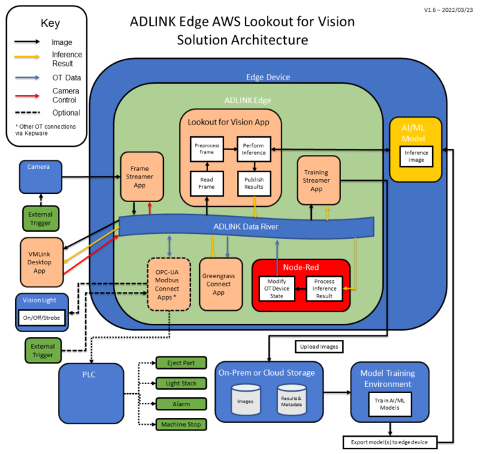

# ADLINK AWS Lookout for Vision Solution Installer

This repository contains a full solution to deploy an AWS Greengrass core, ADLINK streaming application, AWS model, and ADLINK AWS Lookout for Vision inferencing solution to a device and provides a simple UI through Node-RED to view inference results.

This solution can be deployed to an x86 or ARM (aarch64) device.




This installer automates the steps required to deploy the solution as described in <https://goto50.ai/getting-started-with-aws-lookout-for-vision-edge/>

# 1. Instructions
## 1.1 Pre-requisites (Required)
- Python3

## 1.2 Running the solution

To run the installer, clone the repository to the desired device, and from the directory containing the installer run:
``` 
sudo ./lfv-installer.sh
``` 

# 2. User Guide 

This installer consists of multiple stages to create the full solution, the stages are as follows:

1)  Install prerequisite software
2)  Configure AWS CLI
3)  Deploy AWS IoT Greengrass Core to local device
4)  Deploy streamer profile
5)  Deploy inference model
6)  Deploy inference profile
7)  Remove created AWS resources / undo last deployed stage


## 2.1 Install prerequisiste software

This stage installs the necessary software to the device, as required by AWS and ADLINK. 
This software includes:
- AWS Command Line Interface 
- Java (default-JDK)
- Docker and docker-compose
- Cuda and TensorRT (if deploying to a Jetson ARM device)
- Curl and other base libraries.

> x86 users wanting to utilise a NVIDIA graphics card with a GPU trained model will need to manually download and install Cuda and TensorRT from NVIDIA.

## 2.2 Configure AWS CLI

Configuration of the AWS Command Line Interface is required, 'AWS Access Key ID' and 'AWS Secret Access Key' are required for the installer to run. 

>NOTE: Once configured this stage can be re-visited to change credentials at any time if required.

**User Input:**

- AWS Profile <sub>(String)</sub> - Select or create the AWS CLI profile to be used throughout the application. Not providing a profile will utilise the default profile on the device.


## 2.3 Deploy AWS IoT Greengrass Core to local device


This stage downloads and installs the Greengrass Nucleus. 

**User Input:**

- Thing Name <sub>(String)</sub> - A unique thing name to be used for this core, the thing name is also used in policies, roles, and aliases for AWS.
- AWS Deployment Region <sub>(Choice)</sub> - Selects the AWS region to deploy the core and subsequent components to.


## 2.4 Deploy streamer profile

This stage deploys a streamer application to the core device deployed in the previous step. The streamer in this application utilises ADLINK's Frame Streamer or Genicam Streamer. Template profiles are provided and give the option of customising values, a custom streamer profile can be used if desired. 

**User Input:**

- **Choose streamer profile** <sub>(Choice)</sub> - Select streamer profile from a template or custom streamer profile. 
  - **aws-lfv-edge-basic-streamer template** - Utilises ADLINK's Frame Streamer configured to use a connected device (such as a webcam), the user will be prompted to choose the target device identifier in future steps.
  - **aws-lfv-edge-genicam-streamer template** - Utilises ADLINK's GenICam Streamer configured to use a connected GenICam supported device (such as a Basler camera), the user will be prompted to choose the target device camera ID in future steps.
  - **Custom Streamer Profile** - Allows the use of a custom profile created using ADLINK's Edge Profile Builder. This profile must be created using Frame Streamer or GenICam Streamer and exported as a docker-compose. Allows the use of alternative inputs (video files / RTSP).

- **Stream ID** <sub>(String)</sub> - The Stream ID to be used by the streamer profile and later inference profile. Defaults to `[streamID]` in a provided profile file or `camera1` in the case of the template.

- **Streamer Component Name**<sub>(String)</sub> - Offers an opportunity to provide a unique name for the created streamer component on AWS. Defaults to `[ThingName].streamer.component`.

## 2.5 Deploy inference model

Deploys a pre-trained model to the core device to perform inferencing. The model should be trained to match the architecture of the core device it is being deployed to.

**User Input:**

- **Model Name**<sub>(String)</sub> - Declare the name of the exported AWS IoT Greengrass component name for the pre-trained model as it appears on the AWS console.

- **Model Version**<sub>(String)</sub> - Declare the exported AWS IoT Greengrass component version as appears on the AWS console (e.g. `1.0.0`)

## 2.6 Deploy inference profile

Deploys an inference profile to the core device, inference profiles include the following ADLINK applications:
- **aws-lookout-vision** - Connects the source images from the streaming profile to the model, performing inferencing and publishing the results to the datariver.
- **training-streamer** -  Collects inference images and metadata from the datariver and publishes to a configured S3 bucket.
- **greengrass-connect** - Intermediate application to connect inference results with MQTT publishing. MQTT topics can be subscribed to on the AWS IoT console.
- **Node-RED** - Results interface, configured to show the image, frame number, classification, and confidence score in a user-readable format. The Node-RED dashboard can be viewed at `localhost:1880/ui` on the core device.

**User Input:**

- **topic**<sub>(String)</sub> - Defines the MQTT Topic to publish results to. Defaults to `adlink/datariver/[streamID]`
- **Bucket Name**<sub>(String)</sub> -  The bucket to publish the inference results to. If a new bucket is defined for inference results, the results can be kept when removing other AWS resources through the cleanup stage (Stage 7). Defaults to the artifact bucket created in earlier stages `greengrass-component-artifacts-[ThingName]`.  
- **Folder Name**<sub>(String)</sub> -  (Optional) Allows a folder to be declared to store the inference results. If provided the folder will be created in the inference bucket from the previous step, or in the default artifact bucket if no inference bucket was declared. Defaults to blank (stores results on the top level of the bucket).
- **Inference Component Name**<sub>(String)</sub> - Offers an opportunity to provide a unique name for the created inference component on AWS. Defaults to `[ThingName].inference.component`.

## 2.7 Remove created AWS resources / undo last deployed stage

Allows for complete removal of all created components, policies, deployments, roles, aliases, buckets, and artifacts from AWS or stage-by-stage walk back of deployed assets. 

When undoing the last deployed stage the previous stage will be deployed automatically, if any manual changes have been made on the AWS console these will not be retained. 

> NOTE: This stage will not remove the software dependencies that were installed during stage 2 of the installer. 


# 3. Results

- **Node-RED** - Node-RED shows live results as they occur, updating for each frame. The dashboard can be viewed through a web browser running on the device at `localhost:1880/ui`. Alternatively the dashboard can be viewed remotely by substituting localhost with the device IP


- **AWS IoT MQTT** - MQTT messages are shown as live results as they occur, updating for each frame. The image below shows results as they appear when using the AWS IoT test client available at <https://console.aws.amazon.com/iot>.


- **S3 Bucket** - The S3 bucket defined in stage 6 will contain the resulting images (without inference results overlaid) as well as metadata files. <https://console.aws.amazon.com/s3/>

